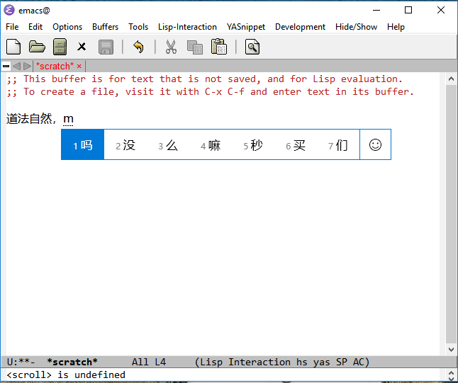

<h2>Table of Contents</h2>

<ul>
<li><a href="#sec-1">1. mingw-w64-emacs</a></li>
</ul>

<table border="2" cellspacing="0" cellpadding="6" rules="groups" frame="hsides">
<caption class="t-above">Table 1: Revision History</caption>

<colgroup>
<col  class="left" />
</colgroup>

<colgroup>
<col  class="left" />
</colgroup>

<colgroup>
<col  class="left" />
</colgroup>

<colgroup>
<col  class="right" />

<col  class="left" />
</colgroup>
<thead>
<tr>
<th scope="col" class="left">Name</th>
<th scope="col" class="left">Data</th>
<th scope="col" class="left">Reason For Changes</th>
<th scope="col" class="right">Version</th>
<th scope="col" class="left">&#xa0;</th>
</tr>
</thead>

<tbody>
<tr>
<td class="left">Ricky.Wu</td>
<td class="left">&#xa0;</td>
<td class="left">Initialization</td>
<td class="right">0.1</td>
<td class="left">&#xa0;</td>
</tr>
</tbody>
</table>

# mingw-w64-emacs

It's emacs whith windows IME patch, you can use it generate mingw64 and mingw32 package
sperate branch 25 for emacs25, master for emacs26

[]
